# Database Entity Relationship Diagram

## Overview

This diagram shows all database tables and their relationships.

**Key Design Decision:** A project can have BOTH audiobook audio AND podcast episodes.
They are generated independently from the same source documents.

## ER Diagram

```mermaid
erDiagram
    USERS {
        uuid id PK
        varchar email UK
        varchar name
        varchar avatar_url
        varchar google_id UK
        timestamp created_at
        timestamp updated_at
    }

    PROJECTS {
        uuid id PK
        uuid user_id FK
        varchar title
        text description
        uuid voice_id FK "optional override"
        varchar status "draft|processing|ready"
        varchar substatus
        int documents_total
        int documents_processed
        int chapters_total
        int chapters_ready
        varchar audiobook_status "null|generating|ready"
        varchar podcast_status "null|generating|ready"
        timestamp created_at
        timestamp updated_at
    }

    DOCUMENTS {
        uuid id PK
        uuid project_id FK
        int position
        varchar title
        varchar author
        varchar source_file_path
        varchar source_type "pdf|article|text"
        int page_count
        varchar status
        varchar substatus
        varchar detection_method
        varchar error_code
        text error_message
        timestamp created_at
        timestamp updated_at
    }

    CHAPTERS {
        uuid id PK
        uuid document_id FK
        uuid project_id FK "denormalized"
        int chapter_number
        varchar title
        text source_text
        int word_count
        int estimated_duration_min
        varchar status
        varchar substatus
        int segments_total
        int key_points_total
        varchar error_code
        text error_message
        timestamp created_at
        timestamp updated_at
    }

    SEGMENTS {
        uuid id PK
        uuid chapter_id FK
        int segment_number
        text text
        int word_count
        int source_start_char
        int source_end_char
        int full_audio_start_ms
        int full_audio_end_ms
        timestamp created_at
    }

    KEY_POINTS {
        uuid id PK
        uuid chapter_id FK
        int key_point_number
        varchar title
        int segment_start
        int segment_end
        int full_audio_start_ms
        int full_audio_end_ms
        timestamp created_at
    }

    SUMMARIES {
        uuid id PK
        uuid chapter_id FK "nullable"
        uuid key_point_id FK "nullable"
        text text
        int word_count
        varchar status
        varchar error_code
        text error_message
        timestamp created_at
        timestamp updated_at
    }

    PODCAST_EPISODES {
        uuid id PK
        uuid project_id FK
        int episode_number
        varchar title
        text description
        text script
        int word_count
        varchar status
        varchar error_code
        text error_message
        timestamp created_at
        timestamp updated_at
    }

    AUDIO_FILES {
        uuid id PK
        uuid chapter_id FK "nullable"
        uuid segment_id FK "nullable"
        uuid summary_id FK "nullable"
        uuid episode_id FK "nullable"
        varchar audio_type
        varchar status
        uuid file_id
        varchar file_path
        int duration_ms
        int file_size_bytes
        uuid voice_id FK
        varchar provider
        int retry_count
        varchar error_code
        text error_message
        timestamp queued_at
        timestamp started_at
        timestamp completed_at
        timestamp created_at
        timestamp updated_at
    }

    VOICES {
        uuid id PK
        varchar provider
        varchar provider_voice_id
        varchar name
        varchar language
        varchar gender
        varchar sample_url
        boolean is_active
        varchar tier_required
        timestamp created_at
    }

    PLAYBACK_PROGRESS {
        uuid id PK
        uuid user_id FK
        uuid project_id FK
        uuid current_chapter_id FK
        varchar current_audio_type
        int position_ms
        varchar listening_mode
        jsonb chapters_completed
        boolean completed
        timestamp last_played_at
        timestamp created_at
        timestamp updated_at
    }

    SHARES {
        uuid id PK
        uuid owner_id FK
        uuid project_id FK "nullable"
        uuid chapter_id FK "nullable"
        uuid segment_id FK "nullable"
        varchar token UK
        varchar recipient_email
        text personal_message
        timestamp expires_at
        boolean is_active
        timestamp created_at
    }

    SHARE_REDEMPTIONS {
        uuid id PK
        uuid share_id FK
        uuid user_id FK
        timestamp redeemed_at
    }

    USER_PREFERENCES {
        uuid user_id PK,FK
        uuid default_voice_id FK
        decimal playback_speed
        varchar default_mode
        boolean auto_play_next
        timestamp created_at
        timestamp updated_at
    }

    %% Relationships
    USERS ||--o{ PROJECTS : "owns"
    USERS ||--o| USER_PREFERENCES : "has"
    USERS ||--o{ PLAYBACK_PROGRESS : "has"
    USERS ||--o{ SHARES : "creates"
    
    PROJECTS ||--o{ DOCUMENTS : "contains"
    PROJECTS ||--o{ PODCAST_EPISODES : "has"
    PROJECTS ||--o{ PLAYBACK_PROGRESS : "tracked_in"
    
    DOCUMENTS ||--o{ CHAPTERS : "contains"
    
    CHAPTERS ||--o{ SEGMENTS : "contains"
    CHAPTERS ||--o{ KEY_POINTS : "contains"
    CHAPTERS ||--o| SUMMARIES : "has"
    CHAPTERS ||--o{ AUDIO_FILES : "has"
    
    KEY_POINTS ||--o| SUMMARIES : "has"
    
    SUMMARIES ||--o| AUDIO_FILES : "has"
    
    SEGMENTS ||--o| AUDIO_FILES : "has"
    
    PODCAST_EPISODES ||--o| AUDIO_FILES : "has"
    
    VOICES ||--o{ AUDIO_FILES : "used_by"
    VOICES ||--o{ USER_PREFERENCES : "default_for"
    
    SHARES ||--o{ SHARE_REDEMPTIONS : "redeemed_by"
```

